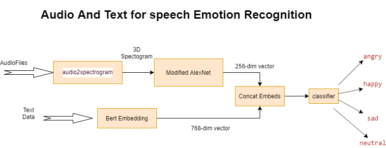

# Audio-and-text-based-emotion-recognition
A multimodal approach on emotion recognition using audio and text. 

A pytorch implementation of the paper 
- Attention Based Fully Convolutional Network for Speech Emotion Recognition (https://arxiv.org/pdf/1806.01506v2.pdf) 
- Multimodal Speech Emotion Recognition using Audio and Text (https://arxiv.org/pdf/1810.04635.pdf)
- Emotion Recognition from Speech (https://arxiv.org/pdf/1912.10458.pdf)

# Objective

This model is used to recognize emotion based on variable length audio inputs and texts.

# Datasets

We used IMEOCAP dataset for the project. It can be downloaded from https://sail.usc.edu/iemocap/
We also omitted one second audio data from the dataset.

# Methodology

* Audio model
* Text model
* Multimodal approach

### Audio model

* The audio data from IEMOCAP dataset is used to extract log spectrogram and 3D spectrogram. Since Alexnet requires 3D convolution(As spectrogram is a 2D image), we stacked delta spectrogram as the third dimension.
* The spectrogram is extracted using signal in scipy library..
* Input data is passed to the AlexNet model. The AlexNet model used in this project is a modified AlexNet which accepts variable length audio signals as its input.

### Text model

* The text data from IEMOCAP dataset(sentences) is used. 
* Every sentence extracted is passed to BERT model and represented as a 768 dimension vector.

### Multimodal approach

* Separately trained audio model and separately trained text model is used here to collect the embeddings.
* The embeddings are concatenated and fed to the classification layer.
* Only the classification layer is trained.
